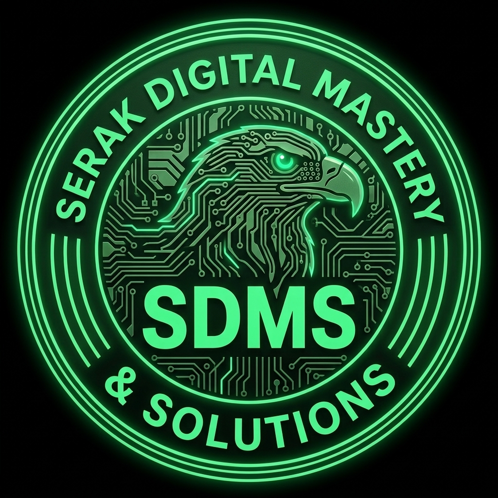

# Serakdep-MS-Devs-Official | Programming Communities

  

**Serakdep-MS-Devs-Official** es la división oficial de programación de **SerakDepMS Studios**. Un ecosistema donde desarrolladores de todos los niveles aprenden, colaboran y construyen juntos. Aquí el conocimiento se comparte, los proyectos crecen y la comunidad se fortalece.

Operamos exclusivamente a través de **WhatsApp**, con un grupo general de recepción y divisiones especializadas por área técnica. Cada miembro puede participar en todas las divisiones que desee.

---

## Canales Oficiales

- **Grupo de WhatsApp:** [Unirme a la comunidad](https://chat.whatsapp.com/FTkmBaGG4Gd70gvAynP0ry) 
- **GitHub:** [github.com/SerakDepMS](https://github.com/SerakDepMS)
- **LinkedIn:** [linkedin.com/in/SerakDepMS](https://www.linkedin.com/in/SerakDepMS)
- **X / Twitter:** [x.com/SerakDepMS_STOS](https://x.com/SerakDepMS_STOS)
- **Instagram:** [instagram.com/serakdepms_oficial](https://www.instagram.com/serakdepms_oficial)

---

## Sobre Nosotros

**Serakdep-MS-Devs-Official** nació con el propósito de construir un espacio donde desarrolladores de todos los niveles puedan crecer juntos, compartir conocimiento y colaborar en proyectos reales. No importa si estás dando tus primeros pasos en el código o si llevas años construyendo sistemas complejos. Lo que importa es la **pasión por aprender**, el **respeto mutuo** y las ganas de **construir juntos**.

- **Misión:** Crear el ecosistema de programación más activo y colaborativo del ecosistema SDMS.
- **Visión:** Formar desarrolladores competentes, éticos y con impacto real en el mundo tecnológico.
- **Valores:** Respeto, colaboración, aprendizaje continuo, honestidad y pasión por el código.

---

## Divisiones Técnicas

Cada división está dedicada a un área específica del desarrollo. Puedes participar en todas las que te interesen.

- **Python & Data Science:** Análisis de datos, automatización, scripting e inteligencia artificial.
- **Web Development:** HTML, CSS, JavaScript, React, Next.js, Vue y arquitecturas modernas.
- **Backend & APIs:** Node.js, Go, Rust, Java. Microservicios, GraphQL, gRPC y sistemas escalables.
- **Mobile Development:** Flutter, React Native, Android (Kotlin) e iOS (Swift).
- **Game Development:** Unity, Unreal, Godot. Creación de videojuegos y experiencias interactivas.
- **Cybersecurity & DevSecOps:** Seguridad por diseño, pentesting, hardening y análisis de vulnerabilidades.
- **AI & Machine Learning:** Modelos predictivos, NLP, visión por computadora y redes neuronales.
- **Algoritmos & Competitive:** Estructuras de datos, resolución de problemas y retos técnicos.

---

## Normas de la Comunidad

Estas normas aplican a todos los grupos de WhatsApp, divisiones y plataformas del ecosistema SerakDepMS.

1. **Respeto ante todo.** No se tolera ningún tipo de insulto, discriminación, acoso o comportamiento tóxico.
2. **Cero spam.** Prohibido el envío masivo de mensajes, cadenas, promociones no autorizadas o enlaces sospechosos.
3. **Temas adecuados por grupo.** Cada grupo tiene una temática específica. Mantén las conversaciones en el lugar correcto.
4. **Ayuda constructiva.** Si respondes una duda, hazlo con respeto y fundamento técnico. No ridiculices a quienes están aprendiendo.
5. **Prohibido contenido ilegal.** No se permite compartir software pirata, cracks, malware, material con derechos sin autorización, o contenido ilegal.
6. **Idioma y comunicación.** El idioma principal es el español. Se permite inglés en contextos técnicos. Evita el uso excesivo de mayúsculas.
7. **Protección de datos.** No compartas información personal de otros miembros sin su consentimiento.
8. **Respeto a la propiedad intelectual.** Al compartir código o recursos, respeta las licencias y da crédito a los autores originales.
9. **No difundir material interno.** Los materiales internos, retos y proyectos en desarrollo son propiedad de SerakDepMS Studios.
10. **Aceptación del reglamento.** Al unirte a la comunidad aceptas este reglamento. El desconocimiento no exime de su cumplimiento.

---

## Sistema de Sanciones

Las sanciones se aplican progresivamente según la gravedad y reincidencia de la falta, respetando las limitaciones propias de WhatsApp.

- **Nivel 1 – Advertencia:** Para faltas leves o primeras infracciones. Se notifica al miembro y se le invita a corregir.
- **Nivel 2 – Advertencia formal:** Para reincidencia o faltas moderadas. Queda registrada. Acumular 3 advertencias formales implica pasar al Nivel 3.
- **Nivel 3 – Expulsión temporal:** Para faltas graves. Se remueve del grupo y se puede readmitir tras un período, bajo condiciones.
- **Nivel 4 – Bloqueo del ecosistema:** Para faltas muy graves. Se prohíbe el acceso a todos los grupos de SerakDepMS Studios de forma permanente.

**Nota:** Todas las sanciones son evaluadas por el equipo de administración de SerakDepMS Studios. En casos especiales se podrá apelar por los canales oficiales.

---

## Preguntas Frecuentes

**¿Cómo puedo unirme a la comunidad?**  
Toda la comunidad se gestiona a través de WhatsApp. Solo debes hacer clic en el botón "Unirme a la comunidad" y entrarás directamente al grupo de recepción.

**¿Necesito saber programar para unirme?**  
No. La comunidad está abierta a todos los niveles, desde principiantes absolutos hasta desarrolladores senior.

**¿Cuánto cuesta ser miembro?**  
Ser miembro es totalmente gratuito. Todas las actividades, recursos y espacios son de acceso libre.

**¿En qué plataforma se reúne la comunidad?**  
Nuestra comunidad vive en WhatsApp. Contamos con un grupo de recepción general y divisiones especializadas por área técnica.

**¿Puedo proponer eventos o proyectos?**  
Sí. Valoramos las iniciativas de nuestros miembros. Puedes contactar a un administrador para presentar tu propuesta.

**¿Serakdep-MS-Devs pertenece a alguna empresa?**  
Sí. Es la división oficial de programación de **SerakDepMS Studios**.

---

## Únete

¿Listo para unirte a la comunidad?  
Entra al grupo de recepción de **Serakdep-MS-Devs-Official** y comienza a formar parte del ecosistema de programación de SerakDepMS Studios.

- Acceso gratuito
- Comunidad activa
- Aprendizaje en conjunto

[**Entrar al grupo de recepción**](https://chat.whatsapp.com/FTkmBaGG4Gd70gvAynP0ry)

---

## Copyright and Usage

The source code, written content, visual design, layouts, branding, original graphics, animations, and project data in this repository are proprietary to **SerakDepMS / Serak Digital Mastery & Solutions**. All rights are reserved.

No copying, modification, redistribution, mirroring, scraping, commercial use, or derivative work is permitted without prior written authorization. Viewing the official portfolio does not grant reuse rights. See [LICENSE](LICENSE) for the complete terms.

Third-party libraries, fonts, icons, and external assets remain subject to their own licenses.

---

  <i>“Deploying secure ecosystems and empowering communities, one tactical commit at a time.”</i>

